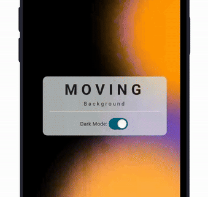

# Flutter Moving Background

A high-performance Flutter package for creating beautiful, customizable moving backgrounds.

See an Example here : https://movingbg.netlify.app/



## Features

- [X] **High Performance**: Optimized with a single `Ticker` and `CustomPainter` for smooth 60fps+ animations.
- [X] **Multiple Animation Types**: `moveAndFade`, `pulse`, `scale`, and `move`.
- [X] **New Background Styles**: Includes `RainBackground` and `BubbleBackground`.
- [X] **Pause/Resume**: Easily pause animations when not needed to save battery.
- [X] **Customizable**: Control colors, radius, blur, speed, and more.
- [X] **Lightweight**: Minimal impact on your app's widget tree.

## Supported Platforms

- Flutter Android
- Flutter iOS
- Flutter Web
- Flutter Desktop

## Getting started

In your flutter project add the dependency:

```yaml
dependencies:
  flutter_moving_background: ^0.1.0
```

Import the package:

```dart
import 'package:flutter_moving_background/flutter_moving_background.dart';
```

## How to use

### Moving Circles Background

```dart
MovingBackground(
  backgroundColor: Colors.white,
  animationType: AnimationType.pulse,
  duration: Duration(seconds: 10),
  circles: const [
    MovingCircle(color: Colors.purple, radius: 300),
    MovingCircle(color: Colors.deepPurple, radius: 500),
    MovingCircle(color: Colors.orange, radius: 400),
  ],
  child: Center(child: Text("Hello World")),
)
```

### Bubble Background

```dart
BubbleBackground(
  numBubbles: 15,
  colors: [Colors.blue, Colors.purple],
  speed: 1.5,
  child: YourWidget(),
)
```

### Rain Background

```dart
RainBackground(
  numberOfDrops: 100,
  fallSpeed: 2.0,
  hasTrail: true,
  child: YourWidget(),
)
```

## Animation Types

| Type | Description |
| --- | --- |
| `moveAndFade` | Circles move to random positions while fading in and out. |
| `pulse` | Circles move while their size and opacity pulse rhythmically. |
| `scale` | Circles scale from zero to full size and back as they move. |
| `move` | Circles move at constant opacity and size. |

## Contributing

Feel free to contribute to this project.

If you find a bug or want a feature, but don't know how to fix/implement it, please fill an [issue][issue].  
If you fixed a bug or implemented a feature, please send a [pull request][pr].

[issue]: https://github.com/IldySilva/flutter_moving_background/issues
[pr]: https://github.com/IldySilva/flutter_moving_background/pulls
